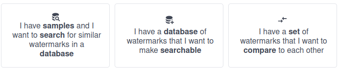
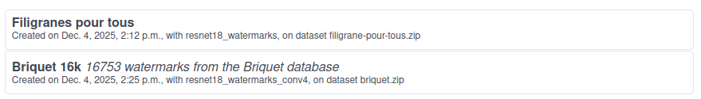
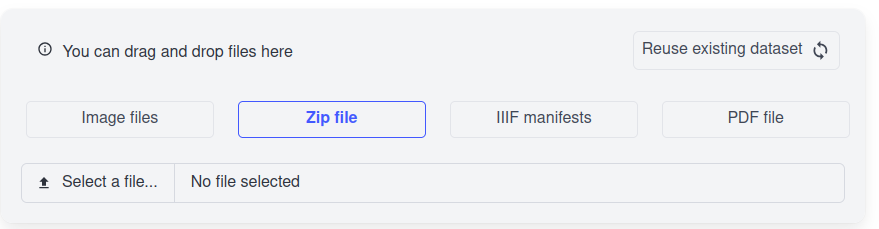
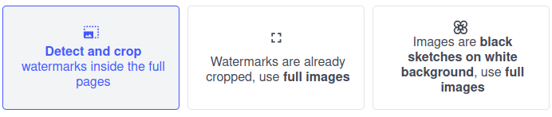

# Watermarks: URL-to-form binding

In the `Start a new Watermarks pipeline` ([URL](https://aikon-demo.enpc.fr/watermarks/start)), the forms can be submitted through URL parameters.

---

## Introductory notes

-  **avoid using quotes** in URL search params: `url_param=value` is not the same as `url_param="value"`. Generally, usage of quotes is handled, but not always

---

## Examples

```
watermarks/start?analysis_type=query&iiif_data=&dataset_type=iiif&dataset_reuse=false&needs_regions=true&watermark_index=Briquet 16k
```

---

## What do you want to do ?

Defines the type of Watermark task to run.

- Svelte component: `WatermarksForm.svelte`
- param name: `analysis_type` 
- param values: `query | indexing | similarity`

This form determines which fields will be displayed next.



--- 

## What index do you want to query

Used in image queries (compare a dataset against existing watermark indexes).

Allows to select the index to use in the query.

- Svelte component: `IndexSelect.svelte`
- param name: `watermark_index`
- param value: the name of one of the existing watermark indexes (i.e., "Briquet 16k" in the picture below).



---

## What is your dataset ?

Defines the dataset to use in your task. Accessible if `analysis_type=indexing|similarity`

- Svelte component: `DatasetComposeForm.svelte`

### Reuse existing dataset ?

Reuse a dataset that exists on AIKON-demo instead of creating a new one

- param name: `dataset_reuse`
- param value: `true | false`

### Select dataset type

If creating a new dataset, the type of dataset to upload.

- param name: `dataset_type`
- param values: `pdf | iiif | zip | images`

### IIIF URLs

Define URLs for the IIIF manifests from which to create datasets. 

Note that for other dataset types (PDF, ZIP, images), values cannot be defined from URLs.

- Svelte component: `IIIFURLListInput.svelte`
- param name: `iiif_data`
- param values: comma-separated URLs: `http://url1,http://url2`.
    - URLs **must** start with `http://` or `https://`. 
    - URLs **must** point to dereferencable IIIF manifests
    - separate multiple URLs with a comma (`,`) and no spaces
    - avoid quotes as always



---

## What kind of images are in the dataset ?

Define type of images so that they can be processed correctly. 

- Svelte component: `NeedRegionsToggle.svelte`
- param name: `needs_regions`
- param values: `true | false | sketches`


